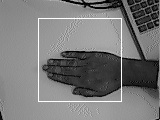

## Description
This tool is visualize images reading from a camera connected to an embedded device. using JLink stream.

## Environment Setup
1. Create virtual python environment using following command.

```console
python -m venv .venv
```
2. Activate virtual environment.
```console
.venv\Scripts\activate
```
3. Install required python packages from requirement.txt.
```console
pip install -r requirements.txt
```

## Usage:
python main.py --camera-resolution <WIDTHxHEIGHT> --target-shape <WIDTHxHEIGHT> --save --out-dir <save/images/to/path>

## Example:
python main.py --camera-resolution 160x120 --target-shape 84x84 

## Note
Keep hand gesture in target region on preview image as follows

